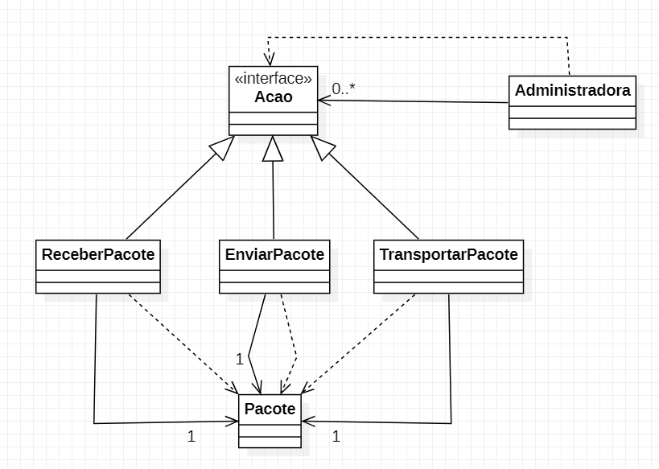

 # Command (ou Action)

Objetivo: separar as funções do sistema em classes diferentes;  
Uma classe gerencia as tarefas, cada tarefa está em uma classe única, que implementa uma interface genérica *Tarefa*.  
A classe que gerencia não tem tarefas, apenas recebe uma injetada.

```Livro: Anti-Padrões```

**Caso de uso:** Entrega de uma compra seguindo o fluxo  
````
Enviado, ✔
EmTransporte, ✔
Recebido, ✔ 
Cancelado, 
Devolvido 
````

Administradora = Marca o estado do pacote (pedido)

Diargama de Classes:  
