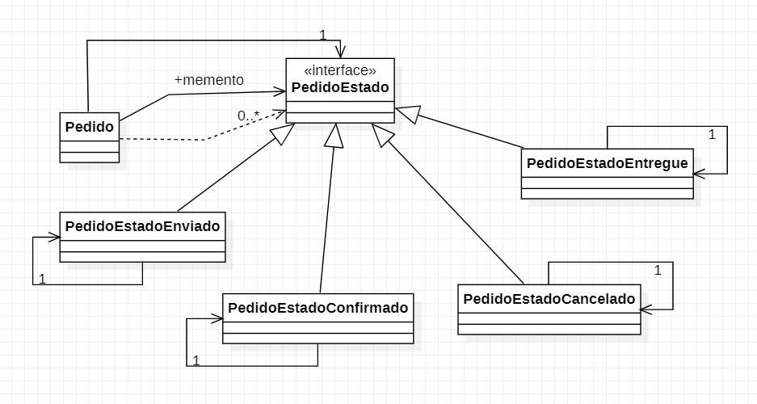

# Padrão Memento

**Caso de Uso**: Estados de um pedido de compra online.  
Pedido Confirmado > Pedido enviado > Pedido entregue  
Podendo haver também: Pedido Cancelado, Pedido Extraviado, Pedido devolvido;

