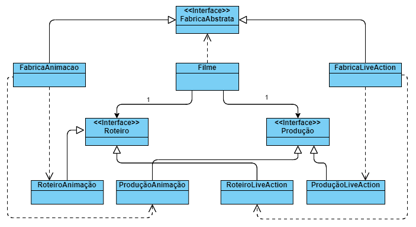

# Padrão Abstract Factory

Utilizar interfaces para que a classe desejada não precise ser especificada.

**Caso de uso**: Criação de um filme que possui vários parametros, sendo dois deles a Produção e o Roteiro.  
Foram criadas interfaces e métodos para a criação/definição do roteiro (roteiristas responsáveis, quantidade de páginas, tempo do filme, etc) e da produção (membros, empresas terceirizadas, locação de espaços, etc).

Diagrama de classes:  
