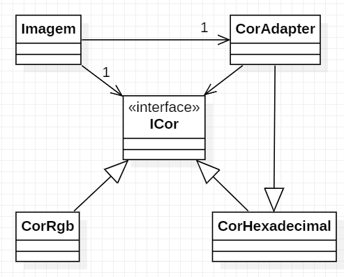

# Padrão Adapter

Usado quando se precisa converter tipos de classe.

**Caso de Uso**: Sistema de processamento de imagens que precisa delas em RGB mas pode receber em Hexadecimal.  
Trabalha apenas as cores: Vermelho, Azul, Amarelo, Branco, Preto e Verde

Diagrama de classes  
