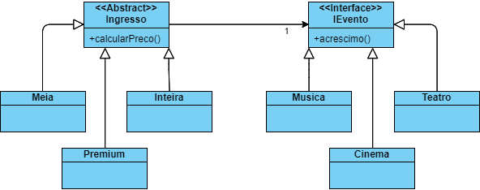

# Padrão Bridge

Possui duas hierarquias diferentes no codigo, onde apenas as duas superclasses se conectam.
Permite então que todas as subclasses se "conectem".
```
[PaiA] -----------> [PaiB]
|                   |
|--Filho1A          |--Fiho1B
|--Filho2A          |--Fiho2B

```

**Caso de Uso**: Tipos diferentes de ingresso para tipos diferentes de eventos.  
*Eventos*: Musica (festivais/shows), Teatro, Cinema, etc.  
*Ingressos*: Meia entrada, Inteira, Premium, etc.


