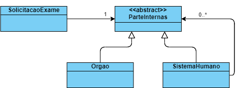

# Padrão Composite

Usado quando se vai compor um objeto para gerar um objeto.

**Caso de Uso**: Solicitação de Exames de partes / sistemas / órgãos do corpo humano.  
*Sistema*: Respiratório, Digestivo, Circulatório, etc.  
*Órgãos*: Apendice, Pulmão, Cérebro, etc.

