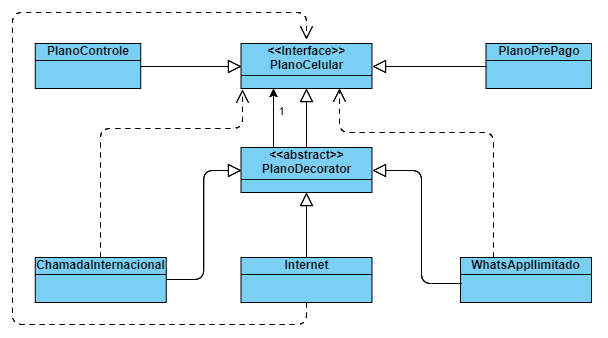

# Padrão Decorator

Adicionar funcionalidades a aplicação *sem mexer* no que já existe.  
**Features OBRIGATORIAMENTE opcionais**

Quando concatenada mais de uma classe vai se tornando uma "lista encadeada"

```Curso curso = new Estagio(new Tcc(new CursoGraduacao('engenharia'))))```

**Caso de Uso**: Empresa com diferentes planos de ceular, e pacotes adicionais.  
Pode ter planos Controle, Pré-pago, etc.  
Esses planos podem, ou não, ter adicionais como chamada internacional, whatsapp ilimitado e internet (5g).

