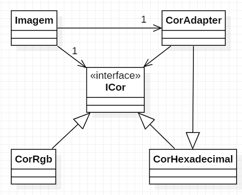
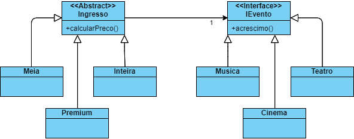
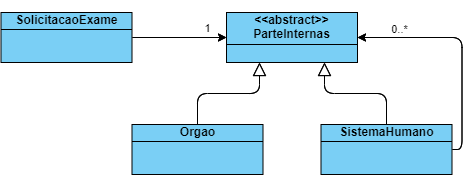
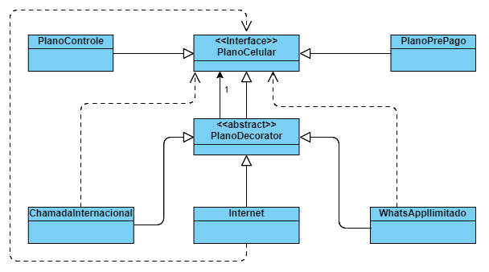
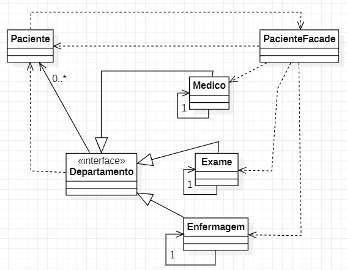
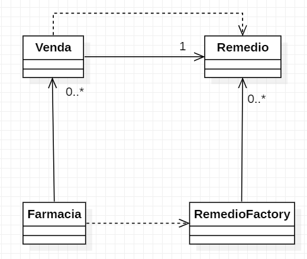
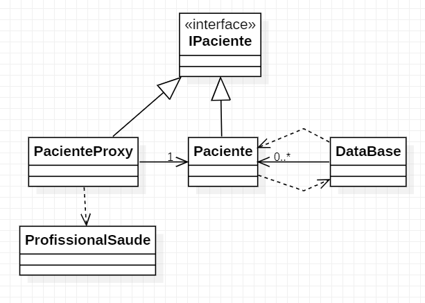
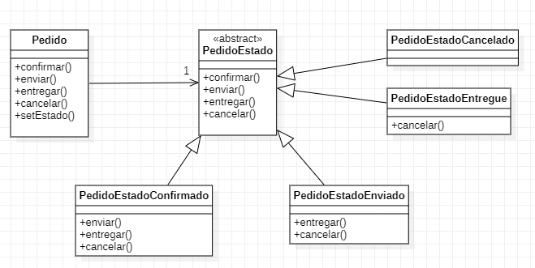

# Padrão Adapter

Usado quando se precisa converter tipos de classe.

**Caso de Uso**: Sistema de processamento de imagens que precisa delas em RGB mas pode receber em Hexadecimal.  
Trabalha apenas as cores: Vermelho, Azul, Amarelo, Branco, Preto e Verde

Diagrama de classes  


# Padrão Bridge

Possui duas hierarquias diferentes no codigo, onde apenas as duas superclasses se conectam.
Permite então que todas as subclasses se "conectem".
```
[PaiA] -----------> [PaiB]
|                   |
|--Filho1A          |--Fiho1B
|--Filho2A          |--Fiho2B

```

**Caso de Uso**: Tipos diferentes de ingresso para tipos diferentes de eventos.  
*Eventos*: Musica (festivais/shows), Teatro, Cinema, etc.  
*Ingressos*: Meia entrada, Inteira, Premium, etc.




# Padrão Composite

Usado quando se vai compor um objeto para gerar um objeto.

**Caso de Uso**: Solicitação de Exames de partes / sistemas / órgãos do corpo humano.  
*Sistema*: Respiratório, Digestivo, Circulatório, etc.  
*Órgãos*: Apendice, Pulmão, Cérebro, etc.



# Padrão Decorator

Adicionar funcionalidades a aplicação *sem mexer* no que já existe.  
**Features OBRIGATORIAMENTE opcionais**

Quando concatenada mais de uma classe vai se tornando uma "lista encadeada"

```Curso curso = new Estagio(new Tcc(new CursoGraduacao('engenharia'))))```

**Caso de Uso**: Empresa com diferentes planos de ceular, e pacotes adicionais.  
Pode ter planos Controle, Pré-pago, etc.  
Esses planos podem, ou não, ter adicionais como chamada internacional, whatsapp ilimitado e internet (5g).



# Padrão Facade

Esconder implementações tendo apenas um ponto de acesso.  
O ponto principal com as agregações necessárias é o Facede.

**Caso de Uso**: Liberação de um paciente do hospital:
- Exames enviados ao paciente?
- Médico deu a liberação (alta)?
- Acompanhante presente para liberação?
- Enfermeiro disponivel para liberação?



# Padrão Flyweight

Objetivo: econimizar recurso.  
Não utilizar objetos iguais repetidos.

**Caso de Uso**: edu.Venda de remédios em uam farmácia, que geralmente vende sempre o mesmo tipo de medicamento.  
Ex: Analgésico, Fitoterápico, Anti-inflamatorio

> Neste caso, cada venda se refere apenas a um remédio.




# Padrão Proxy

Objetivo: econimizar recurso.  
Carrega objetos sob demanada.

- Proxy Dados: Dados carregam a medida que são necessários.
- Proxy de Segurança: dados não carregam por falta de acesso

**Caso de Uso**: Acesso aos dados de pacientes em um hospital.




# Padrão State

Objetivo: Reduzir a quantidade de IFs em um código (complexidade ciclomática).

**Caso de Uso**: Estados de um pedido de compra online.  
Pedido Confirmado > Pedido enviado > Pedido entregue  
Podendo haver também: Pedido Cancelado, Pedido Extraviado, Pedido devolvido;


